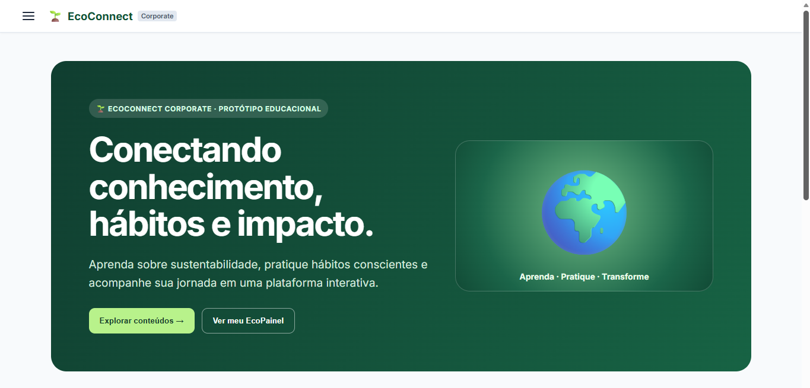
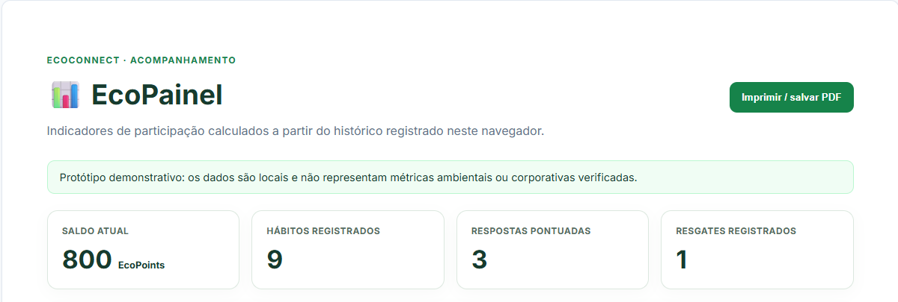
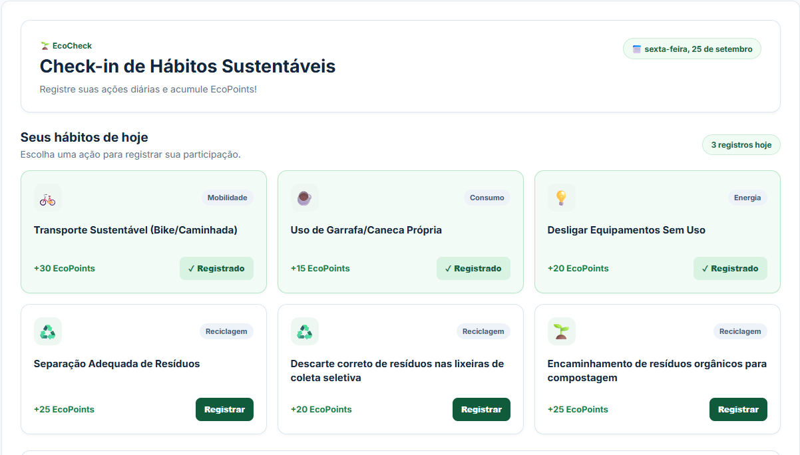

# 🌱 EcoConnect

## Plataforma de Engajamento e Educação para Sustentabilidade Corporativa

O **EcoConnect** é um protótipo de aplicação web desenvolvido como projeto final do curso de **Front-End do SENAI**.

A proposta é utilizar educação, gamificação e acompanhamento de participação para incentivar práticas sustentáveis no cotidiano, reunindo conteúdos educativos, registro de hábitos, quizzes, EcoPoints, recompensas demonstrativas e indicadores em uma única experiência digital.

> **Importante:** o EcoConnect é um protótipo acadêmico e demonstrativo. Os EcoPoints, recompensas, indicadores e dados apresentados não representam benefícios corporativos reais, métricas ambientais verificadas ou certificações de conformidade.

---

## 🎯 Objetivo do projeto

O EcoConnect foi desenvolvido para demonstrar como uma aplicação Front-End pode contribuir para iniciativas de conscientização e engajamento relacionadas à sustentabilidade.

A plataforma busca transformar conceitos ambientais e de governança em uma experiência mais interativa por meio de:

- conteúdos educativos;
- registro de hábitos sustentáveis;
- quizzes de conscientização;
- sistema demonstrativo de EcoPoints;
- simulação de recompensas;
- acompanhamento das atividades realizadas;
- orientações sobre sustentabilidade digital e governança de dados.

O projeto também explora conceitos relacionados a **ESG — Ambiental, Social e Governança**, sem apresentar o protótipo como sistema de auditoria, certificação ou mensuração oficial de desempenho ESG.

---

## 🧩 Módulos

### 🏠 Home

A página inicial apresenta a proposta do EcoConnect e permite conhecer os principais módulos da plataforma por meio de cards e carrossel interativo.

---

### 📚 EcoConteúdo

Biblioteca educativa sobre sustentabilidade e ESG.

Os conteúdos abordam temas como:

- economia circular;
- gestão e separação de resíduos;
- mudanças climáticas;
- emissões de gases de efeito estufa;
- água e energia;
- mobilidade;
- ética e governança;
- ESG no cotidiano.

Os materiais são educativos e sua leitura não gera EcoPoints automaticamente.

---

### 🌱 EcoCheck

Área destinada ao registro demonstrativo de hábitos sustentáveis.

Entre as ações disponíveis estão:

- transporte sustentável;
- utilização de garrafa ou caneca reutilizável;
- desligamento de equipamentos sem uso;
- separação adequada de resíduos;
- utilização correta da coleta seletiva;
- encaminhamento de resíduos orgânicos para compostagem.

Cada ação possui uma quantidade definida de EcoPoints.

O sistema evita que o mesmo hábito seja pontuado mais de uma vez no mesmo dia.

---

### 🧠 EcoQuiz

Módulo de perguntas sobre sustentabilidade.

O usuário pode responder questões relacionadas a temas como:

- Objetivos de Desenvolvimento Sustentável (ODS);
- greenwashing;
- compostagem e resíduos orgânicos.

Respostas corretas concedem EcoPoints demonstrativos.

O histórico da aplicação impede que uma mesma questão correta gere pontuação repetidamente.

---

### 🎁 EcoStore

Loja demonstrativa de recompensas.

Os EcoPoints acumulados podem ser utilizados para **simular** resgates de itens e benefícios apresentados pelo protótipo.

Exemplos:

- cupom de café sustentável;
- kit ecológico;
- muda de árvore;
- day-off demonstrativo.

Nenhuma recompensa apresentada corresponde a benefício real.

---

### 📊 EcoPainel

Painel de acompanhamento das atividades registradas no EcoConnect.

Apresenta informações como:

- saldo atual de EcoPoints;
- quantidade de hábitos registrados;
- respostas pontuadas no EcoQuiz;
- resgates demonstrativos;
- distribuição dos EcoPoints dos hábitos por categoria;
- histórico das atividades recentes.

Os indicadores são calculados a partir das atividades armazenadas localmente no navegador e não representam métricas ambientais ou corporativas verificadas.

O painel também permite utilizar o recurso de impressão do navegador para imprimir ou salvar a visualização em PDF.

---

### 🔐 EcoData

Módulo educativo dedicado à sustentabilidade digital e à governança de dados.

Apresenta diretrizes e propostas relacionadas a:

- privacidade;
- proteção de dados;
- controle de acesso;
- armazenamento consciente;
- retenção e descarte de informações;
- eficiência de infraestrutura digital.

O módulo diferencia as características atuais do protótipo das possibilidades de uma futura implantação corporativa.

---
---

## 🖼️ Interface do EcoConnect

A seguir estão algumas telas da versão atual do protótipo.

### 🏠 Home

A Home apresenta a identidade do EcoConnect, sua proposta educacional e o acesso aos principais módulos da plataforma.



### 📊 EcoPainel

O EcoPainel reúne indicadores calculados a partir das atividades registradas localmente, incluindo saldo de EcoPoints, hábitos, respostas pontuadas e resgates demonstrativos.



### 🌱 EcoCheck

O EcoCheck permite registrar hábitos sustentáveis e visualizar quais ações já foram realizadas no dia.



---
## ⭐ Sistema de EcoPoints

O EcoConnect utiliza um sistema demonstrativo de pontos para representar a gamificação da plataforma.

Os EcoPoints podem ser:

**Adicionados por:**

- hábitos registrados no EcoCheck;
- respostas corretas no EcoQuiz.

**Descontados por:**

- resgates simulados no EcoStore.

Todas essas operações utilizam um serviço central da aplicação, mantendo saldo e histórico integrados entre os módulos.

---

## 💾 Persistência dos dados

O protótipo utiliza o armazenamento local do navegador (`localStorage`) para manter informações entre sessões.

Entre os dados armazenados estão:

- saldo de EcoPoints;
- histórico de atividades;
- registros utilizados pelos módulos integrados;
- estado demonstrativo de autenticação.

A chave principal utilizada para o estado demonstrativo do EcoConnect é:

```text
ecoconnect_demo_state_v1
```

Como os dados ficam no navegador, eles não representam uma base corporativa centralizada e podem variar entre navegadores, dispositivos ou perfis de usuário.

---

## 🔐 Autenticação

O projeto possui uma autenticação demonstrativa implementada no Front-End.

As rotas internas da aplicação são protegidas por um `AuthGuard`, enquanto Home e Login permanecem públicas.

A autenticação atual não utiliza servidor, banco de dados remoto, tokens de autenticação ou serviço corporativo de identidade.

Portanto, ela deve ser entendida exclusivamente como parte do protótipo acadêmico.

---

## 🏗️ Arquitetura

O projeto utiliza uma arquitetura baseada em componentes standalone do Angular.

Estrutura conceitual:

```text
EcoConnect
│
├── Home
├── Login
│
├── Dashboard
│   ├── EcoConteúdo
│   ├── EcoCheck
│   ├── EcoQuiz
│   ├── EcoStore
│   ├── EcoPainel
│   └── EcoData
│
├── Services
│   ├── AuthService
│   ├── EcoService
│   └── ToastService
│
└── Guards
    └── AuthGuard
```

O `EcoService` funciona como elemento central da integração de EcoPoints e histórico entre os módulos.

A comunicação reativa utiliza recursos do **RxJS**, incluindo Observables.

---

## 🛠️ Tecnologias

O projeto utiliza principalmente:

- **Angular 22**
- **TypeScript**
- **HTML**
- **CSS**
- **RxJS**
- **Angular Router**
- **Angular Forms**
- **npm**
- **Git**

O projeto também possui dependências adicionais registradas no `package.json` para experimentação e evolução da aplicação.

---

## 📋 Pré-requisitos

Para executar o projeto localmente é necessário possuir:

- Node.js compatível com a versão do Angular utilizada;
- npm;
- navegador web moderno.

Depois de clonar ou copiar o projeto, instale as dependências:

```bash
npm install
```

---

## ▶️ Executando o projeto

Na pasta raiz do EcoConnect, execute:

```bash
npm start
```

O comando inicia o servidor de desenvolvimento do Angular.

Normalmente, a aplicação poderá ser acessada em:

```text
http://localhost:4200/
```

O servidor de desenvolvimento possui atualização automática durante alterações nos arquivos do projeto.

---

## 🏭 Build de produção

Para gerar uma compilação de produção:

```bash
npm run build
```

Os arquivos compilados são armazenados no diretório:

```text
dist/ecoconnect
```

O projeto possui configuração de build de produção com otimizações do Angular.

---

## 🧪 Testes

O projeto possui infraestrutura de testes unitários baseada no Angular e Vitest.

O comando configurado é:

```bash
npm test
```

Durante a auditoria técnica final do protótipo, o build de produção foi utilizado como principal validação automatizada de compilação. A infraestrutura de execução dos testes unitários apresentou uma questão de descoberta/configuração no ambiente utilizado e, por isso, não se afirma neste documento que toda a suíte automatizada esteja aprovada.

---

## ⚠️ Limitações do protótipo

A versão atual foi desenvolvida para fins acadêmicos e demonstrativos.

Ela não possui:

- backend corporativo;
- banco de dados remoto;
- autenticação corporativa real;
- múltiplas contas persistidas em servidor;
- integração com sistemas de RH;
- recompensas reais;
- cálculo certificado de impacto ambiental;
- auditoria ESG;
- certificação de conformidade com a LGPD;
- sincronização de dados entre dispositivos.

Essas características exigiriam uma arquitetura adicional para utilização em ambiente de produção.

---

## 🚀 Possibilidades de evolução

Uma versão futura poderia incorporar:

- API e backend;
- banco de dados;
- autenticação segura;
- perfis de colaboradores e administradores;
- gestão de equipes;
- metas coletivas;
- campanhas corporativas;
- catálogo real de recompensas;
- notificações;
- relatórios administrativos;
- integração com sistemas corporativos;
- políticas avançadas de privacidade e segurança;
- indicadores ambientais provenientes de fontes verificáveis.

Essas funcionalidades representam possibilidades de evolução e não características da versão atual.

---

## 🌍 Relação com sustentabilidade e ESG

O EcoConnect foi concebido principalmente como ferramenta de **educação e engajamento**.

O projeto aborda conceitos ambientais, sociais e de governança por meio de conteúdo, hábitos e conscientização.

A plataforma não substitui metodologias formais de inventário de emissões, auditorias, sistemas de gestão ambiental ou processos corporativos de compliance.

Seu papel no protótipo é demonstrar como recursos digitais e gamificação podem apoiar iniciativas de conscientização.

---

## 🎓 Contexto acadêmico

Projeto desenvolvido como **Desafio Final / Trabalho de Conclusão do curso de Front-End do SENAI**.

O desenvolvimento envolveu conceitos de:

- desenvolvimento Front-End;
- componentização;
- navegação;
- gerenciamento de estado;
- programação reativa;
- persistência local;
- responsividade;
- experiência do usuário;
- sustentabilidade;
- gamificação.

---

## 👨‍💻 Autor

**Darlan Silva**

Projeto acadêmico — SENAI
2026
---

## 📄 Observação final

O EcoConnect representa um **protótipo funcional de Front-End**.

As funcionalidades foram desenvolvidas para demonstrar uma proposta de plataforma digital de educação, engajamento e gamificação aplicada à sustentabilidade, mantendo clara a separação entre recursos implementados no protótipo e funcionalidades que exigiriam infraestrutura corporativa para uma implantação real.
